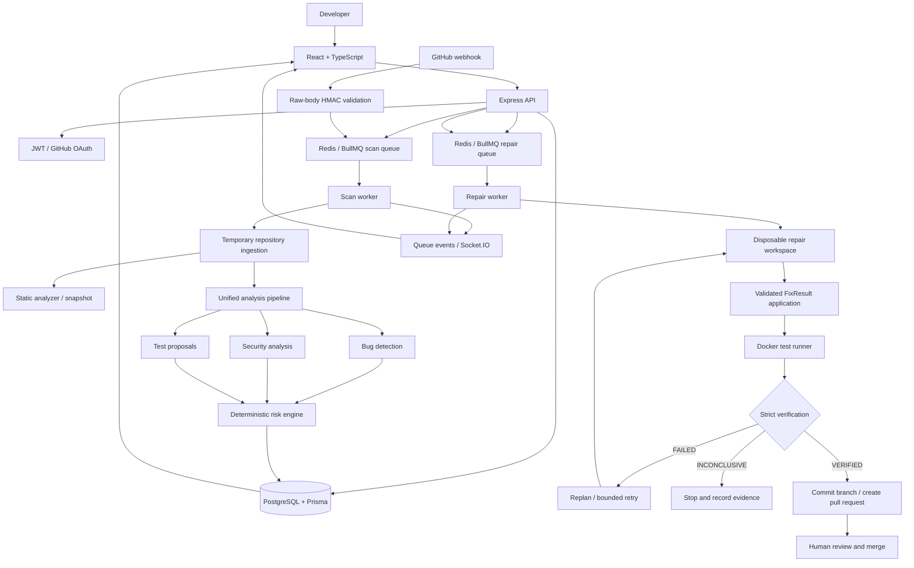

# RepoDoctor AI — Architecture and Design

**Documentation baseline:** uploaded reconciled project archive and supporting documents, reviewed 10 October 2026. This document distinguishes source-tree evidence from runtime verification.

## 1. System goals

RepoDoctor aims to assist a developer with repository analysis and a cautious repair workflow:

1. Connect a user to GitHub and list repositories available to that user.
2. Ingest a selected repository into a temporary workspace and record its source reference.
3. Analyze repository structure and build context for AI agents.
4. Produce structured bug/security findings, test proposals, and deterministic risk assessments.
5. Generate a structured repair proposal for a selected finding.
6. Apply the proposal in a disposable repair workspace.
7. Run configured verification in Docker and classify the evidence conservatively.
8. Publish a pull request only if verification succeeds.
9. Keep the user informed through job status and live progress events.

The design favors safety and traceability over claiming that AI output is always correct. Passing tests is useful evidence, not a mathematical proof of correctness.

## 2. Technology and module boundaries

| Layer | Responsibility | Main technologies |
|---|---|---|
| Web client | Authentication UI, repository selection, analysis/history display, progress, repair status | React, TypeScript, Vite |
| HTTP API | Authentication, repository operations, scan/repair requests, status endpoints, webhook endpoint | Node.js, Express, TypeScript ESM/NodeNext |
| Persistence | Users, linked repositories, analysis results, findings, proposals, job/repair records | PostgreSQL, Prisma |
| Queue | Durable asynchronous scan/repair scheduling and job lifecycle | Redis, BullMQ |
| Scan worker | Clone/read repository, inspect structure, run analysis pipeline, persist results/progress | Node.js worker process |
| Repair worker | Execute the bounded repair workflow and verified-only publication path | Node.js worker process |
| AI provider layer | Provider abstraction and provider switching | `AIProviderManager`, OpenRouter/Groq/Gemini |
| Repair execution | Isolated patch application and controlled tests | Disposable workspace, Docker runner |
| GitHub integration | OAuth, repository API, webhook event intake, branch/PR publication | GitHub OAuth/API/webhooks |
| Live status | User-scoped progress notifications and REST recovery | Socket.IO + JWT |

## 3. High-level system diagram



The diagram represents the intended flow described by the archive. It is not evidence that the whole system has passed a live end-to-end run.

## 4. Analysis flow

### 4.1 Repository ingestion and snapshot

The API accepts a scan request and, in the reconciled design, enqueues it for a scan worker. The worker clones or otherwise stages the selected repository in a temporary workspace, records the analyzed source reference, inspects repository metadata, and runs the analysis pipeline while the required source context still exists. Cleanup must occur in a `finally`-style lifecycle so a failed analysis does not leave unnecessary workspace data behind.

The original GitHub repository is not modified during ingestion or analysis. Repository scripts should not be executed just to detect framework or package metadata.

### 4.2 Context and AI provider management

The AI provider architecture is managed through `AIProviderManager` and the provider factory. The recorded order is:

1. OpenRouter — primary.
2. Groq — secondary.
3. Gemini — tertiary.

The supplied notes record an OpenRouter HTTP 429 followed by a successful Groq response. That is a recorded focused observation, not a guarantee that all provider failover cases work today. Live integration should be repeated after dependency and environment setup.

The repository context API requires both arguments:

```ts
buildRepositoryContext(repositoryPath, repositoryId)
```

The actual repository ID must be passed; do not substitute an analysis ID. TypeScript uses ESM/NodeNext, so relative TypeScript imports generally use `.js` extensions in source imports, for example:

```ts
import { runDockerTest } from "../execution/docker.runner.js";
```

### 4.3 Unified analysis pipeline

The recorded pipeline runs the following stages and persists their outputs:

- Bug detection agent.
- Security analysis agent and selected deterministic heuristic checks.
- Test-generation agent, which proposes tests rather than guaranteeing they are executable in every target repository.
- Deterministic risk calculation based on finding properties.
- Persistence and progress reporting.

Risk scoring is application logic, not an LLM verdict. Its calibration against a representative benchmark remains unmeasured.

## 5. Repair flow and invariants

```text
Persisted finding
      ↓
Fix agent → structured FixResult
      ↓
Validate proposal and target paths
      ↓
Create disposable repair workspace + repair branch
      ↓
applyFixResult(repositoryPath, fixResult)
      ↓
runDockerTest() in Docker
      ↓
Evidence-based verification
      ├── VERIFIED → commit/push repair branch → create PR
      ├── FAILED → use failure evidence to replan → retry if attempts remain
      └── INCONCLUSIVE → stop; do not publish
```

### 5.1 Repair contracts and paths

Authoritative paths recorded in the project documents:

```text
server/src/services/
server/src/repair/retry/repair.retry.service.ts
server/src/execution/docker.runner.ts
server/src/ai/ai.provider.ts
server/src/ai/ai.provider.factory.ts
```

Key APIs/contracts:

```ts
buildRepositoryContext(repositoryPath, repositoryId)
applyFixResult(repositoryPath, fixResult)
removeRepairWorkspace(workspace.rootPath)
```

`repositoryPath` passed to `applyFixResult` must point to the isolated repair workspace, never the user's original working tree.

### 5.2 Retry policy

- Maximum repair attempts: three.
- Attempt 1 uses the original finding and normal Fix Agent flow.
- Replanning is used for subsequent attempts after failure evidence exists.
- The attempt history is represented by `attempts: RetryAttemptResult[]` in the recorded implementation.
- The Docker test input can carry `REPO_DOCTOR_ATTEMPT` metadata.
- Insufficient evidence produces `INCONCLUSIVE`, which stops the loop and is not a successful repair.

### 5.3 Verification-gated publication

Only a strictly verified result may continue to branch commit, push, and pull-request creation. The publisher must not:

- Push directly to the default branch.
- Force-push.
- Auto-merge.
- Publish an `FAILED`, `INCONCLUSIVE`, error, or exhausted-retry result as a successful repair.
- Place a GitHub token in a Docker test container, a clone URL, or ordinary Git command arguments.

A pull request is a proposal for human review, not an automatic change to the target branch.

## 6. Queue and live-progress architecture

The reconciled archive describes:

- A BullMQ repository-scan queue and separate scan worker.
- A repair queue and separate repair worker.
- Job-status endpoints scoped to the authenticated user.
- Queue retry/retention settings and progress callbacks.
- Queue-event forwarding to authenticated Socket.IO user rooms.
- REST status lookup/polling as a recovery path if the client misses a live event.
- GitHub delivery-ID-based deduplication for webhook-enqueued work.

The queue and event architecture needs runtime validation against real Redis/PostgreSQL services. A source-level event handler is not proof of correct reconnection, deduplication, or worker recovery under failure.

## 7. GitHub webhook architecture

The webhook endpoint is recorded as:

```text
POST /api/github/webhook
```

The request handler captures the raw JSON body and validates `X-Hub-Signature-256` using HMAC and constant-time comparison before trusting the payload. Supported event scope is limited to `push` and selected `pull_request` actions. The delivery ID is used to deduplicate queued work.

Fork pull requests are intentionally ignored in this version. Do not broaden this behavior until a trust policy for fork code, permissions, and token scope has been designed and tested.

## 8. Data and trust boundaries

| Data | Trust level | Required handling |
|---|---|---|
| User input and API parameters | Untrusted | Validate and authorize every operation |
| GitHub webhook body | Untrusted until signature validation | Verify raw-body signature before processing |
| Repository files and package scripts | Untrusted | Inspect statically; run only in controlled execution boundary |
| AI output / proposed patch | Untrusted | Parse schema, validate paths/content, then apply in isolated workspace |
| Test stdout/stderr | Untrusted evidence | Bound size/time and do not treat arbitrary text as proof of success |
| GitHub access token | Secret | Never log or pass into test container; encrypt at rest before production |
| Database/AI credentials | Secret | Environment/secret manager only; never mount into untrusted execution |
| Verification status | Decision evidence | Publish only for explicit verified state |

## 9. Known design limitations

- The current AI security agent and heuristic scanner do not equal comprehensive SAST, secret scanning, or dependency auditing.
- Generated test proposals may not run if the target project's dependencies are unavailable in the restricted environment.
- The runner's isolation boundary must be reviewed against the actual Docker configuration and host environment.
- OAuth tokens are reported as unencrypted at rest in the supplied archive.
- Rate limiting, deployment hardening, RAG/repository memory, and a measured benchmark are not evidenced as complete in the supplied archive.
- The development Compose file is not a production deployment recipe.

## 10. Architecture acceptance criteria

Before claiming the architecture is production-ready, demonstrate all of the following in a clean environment:

- API, scan worker, repair worker, PostgreSQL, Redis, and client start independently and health-check correctly.
- A scan request is persisted/enqueued exactly once or deduplicated according to policy.
- The analysis pipeline receives the correct repository ID and persists findings.
- A repair uses a disposable workspace and cannot mutate the source checkout.
- Test execution cannot access network or application secrets and obeys resource/time limits.
- Failed/inconclusive verification never creates a PR.
- A verified repair creates a branch/PR in a disposable test repository without merging it.
- Queue failures and missed live events can be recovered through persisted job status.
